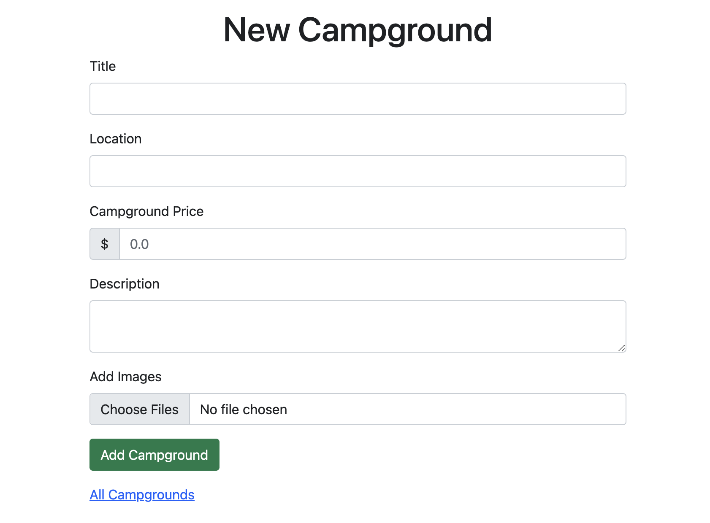

# Camper

Camper is a full-stack web development project based on Javascript using Express framework. It involves setting up RESTful APIs, maintaining remote MongoDB database,
as well as boilerplating outlook using Bootstrap.

## Set up:
1. git clone the project to your local or AWS server. ```git clone ```
2. cd into the project root ```cd Camper```
3. run command: ```node app.js```


### Home page 


It supports user registration and login, for which authentication is realized by javascript package passport. Registered user information is sent to MongoDB database.


### Login / Registration 
 


### Creating post
Registered user can use the button "New Campground" to post a new campground. The form supports input validation enabled by Bootstrap. User can upload image to represent their campground, the uploaded image will be stored remotely on Cloudinary.



### Show page
User (registered or non-registered) can click cards and see the details for campgrounds, however, only the original poster has the authorization to edit/delete the campground.
Any registered user can post review for any campground.


The project was deployed on AWS EC2 server.
